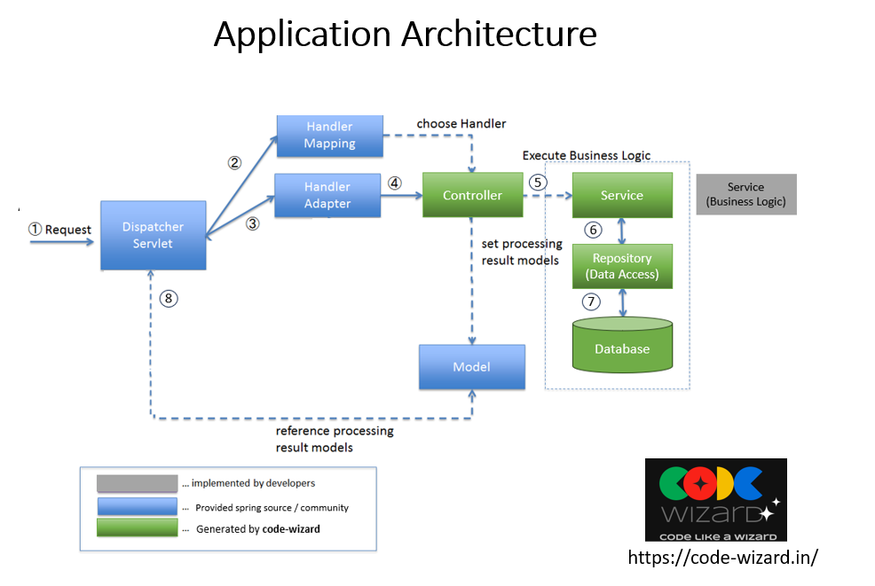

# OData V4 Test Service


This project is a Spring Boot application implementing an OData V4 test service using SAP's JPA Processor V4. It serves as a foundational example for integrating OData services with Spring Boot.

## Table of Contents

- [Architecture](#architecture)
- [Features](#features)
- [Prerequisites](#prerequisites)
- [Installation](#installation)
- [Usage](#usage)
- [Testing](#testing)
- [Project Structure](#project-structure)
- [Contributing](#contributing)
- [License](#license)

## Architecture



*Figure 1: System Architecture Overview*

## Features

- **OData V4 Implementation:** Leverages SAP's JPA Processor V4 for OData services.
- **Spring Boot Integration:** Simplifies application setup and deployment.
- **Docker Support:** Containerized setup for consistent environments.
- **Comprehensive Testing:** Includes unit and integration tests.

## Prerequisites

- [Docker](https://www.docker.com/get-started)
- [Docker Compose](https://docs.docker.com/compose/install/)
- [Maven](https://maven.apache.org/install.html)

## Installation

1. **Clone the repository:**

   ```bash
   git clone https://github.com/username/backend_repo.git
   ```

2. **Navigate to the project directory:**

   ```bash
   cd backend_repo
   ```

3. **Build the Docker images:**

   ```bash
   docker-compose build
   ```

   *To build a specific service (e.g., `app`), use:*

   ```bash
   docker-compose build app
   ```

## Usage

1. **Start the application:**

   ```bash
   docker-compose up -d
   ```

2. **Stop the application:**

   ```bash
   docker-compose stop app
   ```

3. **Shut down the application:**

   ```bash
   docker-compose down app
   ```

## Testing

- **Run test cases:**

  ```bash
  mvn verify
  ```

- **Compile without running tests:**

  ```bash
  mvn clean install -DskipTests=true
  ```

## Project Structure

The project follows a standard Spring Boot structure:

```
generated_app/
│── src/
│   ├── main/java/com/example/model/
│   │   ├── Entity.java  # Entity representing an entity
│   ├── main/java/com/example/repository/
│   │   ├── EntityRepository.java  # Repository interface for database operations
```

### Model (`Entity.java`)
- Represents the individual entity.
- Annotated with `@Entity`, meaning it maps to a database table.
- Attributes specified in the model are present here.

### Repository (`EntityRepository.java`)
- Extends `JpaRepository<Entity, Long>`.
- Provides CRUD operations without writing queries.
- Custom query method `findByName(String name)` to retrieve the entity by name.

## Contributing

Contributions are welcome! Please fork the repository and create a pull request with your changes.

## License

This project is licensed under the MIT License.

